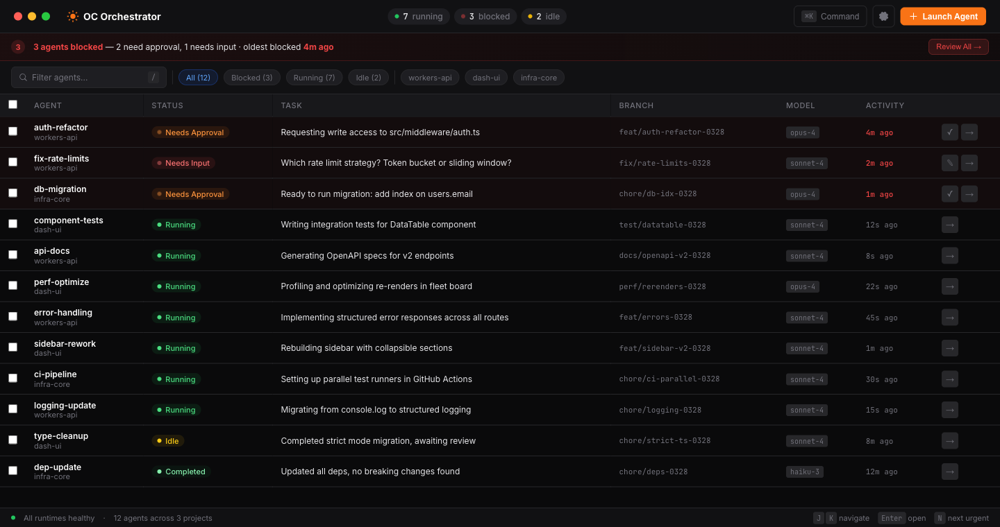

# OC Orchestrator

Desktop app for running and supervising 10+ concurrent [OpenCode](https://github.com/nichochar/opencode) agents across multiple local projects.



## Features

- **Fleet table** — see all agents at a glance with status, task, branch, model, and activity
- **Detail drawer** — messages, tool calls, file changes, and event log for each agent
- **Permission handling** — approve or deny tool calls across all agents from one place
- **Worktree isolation** — each agent gets its own git worktree so work runs in parallel without branch conflicts
- **`/new`** — reset an agent's conversation and branch without leaving the fleet table
- **`/model`** — switch models on the fly per agent
- **Auto PR** — one-click PR creation with smart branch renaming
- **Command palette** — quick access to all actions via `Cmd+K`
- **Auto-update** — notifies when a new version is available on npm

## Install

```bash
npm install -g oc-orchestrator
```

Requires [OpenCode](https://github.com/nichochar/opencode) to be installed and available in your PATH (or set `OPENCODE_PATH`).

## Run

```bash
oc-orchestrator
```

## Development

```bash
git clone https://github.com/WalshyDev/oc-orchestrator.git
cd oc-orchestrator
npm install
npm run dev
```

### Commands

| Command | Description |
|---------|-------------|
| `npm run dev` | Start Electron dev server with hot reload |
| `npm run build` | Production build |
| `npm run lint` | ESLint |
| `npm run typecheck` | Type check both main and renderer |
| `npm test` | Run unit tests |

### Environment Variables

| Variable | Default | Description |
|----------|---------|-------------|
| `OPENCODE_PATH` | system PATH | Path to opencode binary |
| `OC_ORCHESTRATOR_DB_PATH` | `~/.oc-orchestrator/data.db` | SQLite database location |
| `OC_ORCHESTRATOR_WORKTREE_ROOT` | `~/.oc-orchestrator/worktrees` | Worktree root directory |
| `OC_ORCHESTRATOR_LOG_LEVEL` | `info` | Log level (debug, info, warn, error) |

## Architecture

Electron + React + TypeScript. SQLite for local persistence. Communicates with OpenCode servers via the `@opencode-ai/sdk`.

- **Main process** — runtime management, agent controller, event bridge, database
- **Renderer** — React 19 with TailwindCSS 4, central state via `useSyncExternalStore`

## License

MIT
