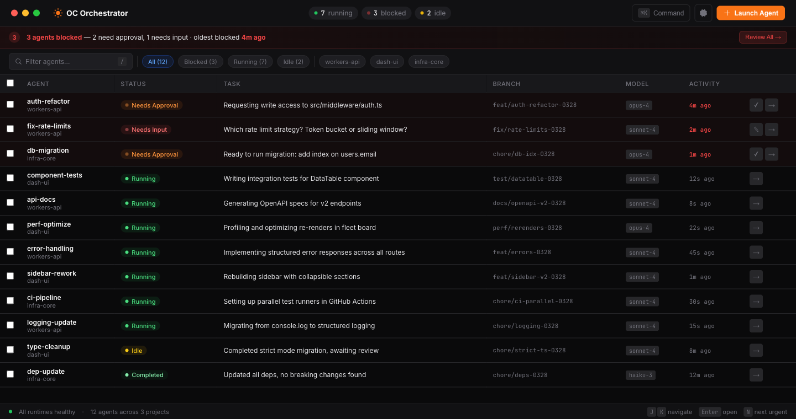

# OC Orchestrator

Desktop app for running and supervising 10+ concurrent [OpenCode](https://github.com/nichochar/opencode) agents across multiple local projects.



## Features

- **Fleet table** — see all agents at a glance with status, task, branch, model, and activity
- **Detail drawer** — messages, tool calls, file changes, and event log for each agent
- **Permission handling** — approve or deny tool calls across all agents from one place
- **Question handling** — respond to agent questions and input requests inline
- **Worktree isolation** — each agent gets its own git worktree so work runs in parallel without branch conflicts
- **Labels & workflow tags** — mark agents as In Review, Blocked, Done, or Draft to track progress
- **Filter & search** — filter by status, label, or project; search by name or task; state persists across restarts
- **Interrupt banner** — blocked and errored agents surface at the top for quick triage
- **Session browser** — browse and resume previous sessions per project
- **Model picker** — switch models on the fly per agent with provider selection
- **MCP management** — view, connect, and disconnect MCP servers per agent
- **`/new`** — reset an agent's conversation and branch without leaving the fleet table
- **`/model`** — switch models on the fly per agent
- **Auto PR** — one-click PR creation with editable PR links
- **Image attachments** — attach images to agent messages
- **Command palette** — quick access to all actions via `Cmd+K`
- **Desktop notifications** — configurable alerts for blocked, errored, and completed agents
- **Auto-update** — notifies when a new version is available on npm

## Install

```bash
npm install -g oc-orchestrator
```

Requires [OpenCode](https://github.com/nichochar/opencode) to be installed and available in your PATH (or set `OPENCODE_PATH`).

## Run

```bash
oc-orchestrator
```

## Development

```bash
git clone https://github.com/WalshyDev/oc-orchestrator.git
cd oc-orchestrator
npm install
npm run dev
```

### Commands

| Command | Description |
|---------|-------------|
| `npm run dev` | Start Electron dev server with hot reload |
| `npm run build` | Production build |
| `npm run lint` | ESLint |
| `npm run typecheck` | Type check both main and renderer |
| `npm test` | Run unit tests |

### Releases

Release scripts now prepare the version bump locally and publishing happens automatically from GitHub Actions when that version lands on `main`.

```bash
npm run release        # patch
npm run release:minor  # minor
npm run release:major  # major
git push origin <branch>
```

Each release script requires a clean git working tree, runs typecheck and tests, updates the version files, and creates the release commit locally without creating a git tag on your branch.

Open a PR and merge it into `main` to publish that version to npm. The publish workflow runs only after the change lands on `main`, not on the PR itself. It publishes when the current `main` version is not yet on npm, so a failed publish can be retried by merging a follow-up fix without bumping the version again.

After a successful publish, GitHub Actions creates the matching `vX.Y.Z` tag on the resulting `main` commit. This works with rebase merges because the tag is created after the rewritten commit exists on `main`.

Configure a trusted publisher for this package on npm using repository `WalshyDev/oc-orchestrator` and workflow filename `publish.yml`. No `NPM_TOKEN` secret is needed for publishing.

This repo currently installs dependencies with `legacy-peer-deps=true` via `.npmrc` because `@typescript-eslint/parser@8.57.2` does not accept TypeScript 6 peer ranges yet.

### Environment Variables

| Variable | Default | Description |
|----------|---------|-------------|
| `OPENCODE_PATH` | system PATH | Path to opencode binary |
| `OC_ORCHESTRATOR_DB_PATH` | `~/.oc-orchestrator/data.db` | SQLite database location |
| `OC_ORCHESTRATOR_WORKTREE_ROOT` | `~/.oc-orchestrator/worktrees` | Worktree root directory |
| `OC_ORCHESTRATOR_LOG_LEVEL` | `info` | Log level (debug, info, warn, error) |
| `OC_ORCHESTRATOR_DEMO_MODE` | — | Enable demo mode with mock data (for screenshots) |
| `OC_ORCHESTRATOR_RUNTIME_IDLE_TIMEOUT_MS` | `300000` | Idle timeout before stopping unused runtimes |

## Architecture

Electron + React + TypeScript. SQLite for local persistence. Communicates with OpenCode servers via the `@opencode-ai/sdk`.

- **Main process** — runtime management, agent controller, event bridge, database
- **Renderer** — React 19 with TailwindCSS 4, central state via `useSyncExternalStore`

## External HTTP API

OCO exposes a localhost HTTP API for external tools to launch and control agents. The intended use case is bridging external triggers (voice prompts, hotkeys, scripts) into OCO's fleet, with the option to attach the OpenCode TUI to the same session OCO created. Both clients then see the same SSE event stream.

The server binds to `127.0.0.1` only and is gated by a per-launch random token (see Discovery below). Don't expose the port off the loopback interface — the auth model is "anyone with read access to your home directory can drive OCO," not "anyone on the machine."

### Discovery

On startup, OCO writes the listening port and a per-run auth token to a JSON file inside Electron's `userData` directory. The exact path depends on how OCO is running:

- macOS: `~/Library/Application Support/oc-orchestrator/api.json`
- Linux: `~/.config/oc-orchestrator/api.json`
- Windows: `%APPDATA%\oc-orchestrator\api.json`

```json
{
  "port": 54321,
  "pid": 12345,
  "startedAt": 1731112233000,
  "version": "1.2.3",
  "token": "a1b2c3..."
}
```

Always check `pid` is alive before using `port` — the file isn't cleaned up on hard crash. The `token` is regenerated each launch and required for every mutating request via `Authorization: Bearer <token>`.

### Endpoints

Every request except `GET /health` requires `Authorization: Bearer <token>` where the token comes from the discovery file. The public contract is keyed on `sessionId`, not OCO's internal `agentId`, so the same identifier flows directly into `opencode attach --session <id>` without translation.

| Method | Path | Body | Returns |
|--------|------|------|---------|
| `GET` | `/health` | — | `{ ok, version, pid }` |
| `POST` | `/sessions` | `{ dir, prompt?, model?, title?, resume? }` | `{ agentId, sessionId, runtimeUrl, directory, leaseId, leaseExpiresAt }` |
| `POST` | `/sessions/:sessionId/prompt` | `{ text, model? }` | `{ ok }` |
| `POST` | `/sessions/:sessionId/abort` | — | `{ ok }` |
| `POST` | `/leases/:leaseId/refresh` | — | `{ ok, expiresAt }` |
| `DELETE` | `/leases/:leaseId` | — | `{ ok }` |

`POST /sessions` requires `dir` to be a git repository — non-git paths are rejected with `400 not_a_git_repo`. The directory is normalized to its canonical repo root before any agent or project work happens, and that canonical root is what gets returned in the response (and is what you should pass to `opencode attach --dir`).

`resume` is mutually exclusive with `prompt` and `model`; combining them returns `400 bad_request`. To resume and then send a message, call `POST /sessions { dir, resume }` followed by `POST /sessions/:sessionId/prompt { text }`.

### Source attribution

Send `X-OCO-Source: <label>` to identify the calling tool. The label appears in the desktop notification ("Voice prompt attached → my-project") and in the row flash on the FleetTable. Falls back to "External" if absent. The notification can be toggled in **Settings → Notify When → External Session Attached**.

### Lease model

`POST /sessions` returns a `leaseId` with a 30-minute TTL. While the lease is active, OCO's idle reaper won't reap the runtime even if there's no other activity. Refresh every ~5 minutes via `POST /leases/:leaseId/refresh`. Release with `DELETE /leases/:leaseId` when done. Expired leases are pruned lazily.

Refreshing a lease whose underlying session has been removed from OCO returns `410 session_gone` and drops the lease — that prevents a forgotten refresher from pinning a runtime alive after its session has gone away.

### Example: voice-prompt → OCO + TUI

```bash
#!/usr/bin/env bash
DISCOVERY="$HOME/Library/Application Support/oc-orchestrator/api.json"

PORT=$(jq -r .port "$DISCOVERY")
TOKEN=$(jq -r .token "$DISCOVERY")
PID=$(jq -r .pid "$DISCOVERY")
kill -0 "$PID" 2>/dev/null || { echo "OCO is not running"; exit 1; }

AUTH=(-H "Authorization: Bearer $TOKEN")

# Create the session in OCO.  resume + prompt are mutually exclusive — to
# pick up an existing session and then send a message, do two requests.
RESP=$(curl -fs -X POST "http://127.0.0.1:$PORT/sessions" \
  "${AUTH[@]}" \
  -H "Content-Type: application/json" \
  -H "X-OCO-Source: voice-prompt" \
  -d "$(jq -n --arg dir "$WORKDIR" --arg prompt "$PROMPT" '{dir:$dir,prompt:$prompt}')")

RUNTIME_URL=$(echo "$RESP" | jq -r .runtimeUrl)
SESSION_ID=$(echo "$RESP" | jq -r .sessionId)
LEASE_ID=$(echo "$RESP"   | jq -r .leaseId)

# Refresh the lease in the background, release on exit.
( while sleep 300; do
    curl -fs -X POST "${AUTH[@]}" "http://127.0.0.1:$PORT/leases/$LEASE_ID/refresh" >/dev/null || break
  done ) &
REFRESHER=$!
trap "kill $REFRESHER 2>/dev/null; \
      curl -fs -X DELETE \"${AUTH[@]}\" \"http://127.0.0.1:$PORT/leases/$LEASE_ID\" >/dev/null" EXIT

# Attach the OpenCode TUI to OCO's runtime, on the just-created session.
# Both clients now share SSE events: typing in the TUI shows in OCO,
# approving permissions in OCO unblocks prompts the TUI sent.
exec opencode attach "$RUNTIME_URL" --session "$SESSION_ID" --dir "$WORKDIR"
```

## License

MIT
